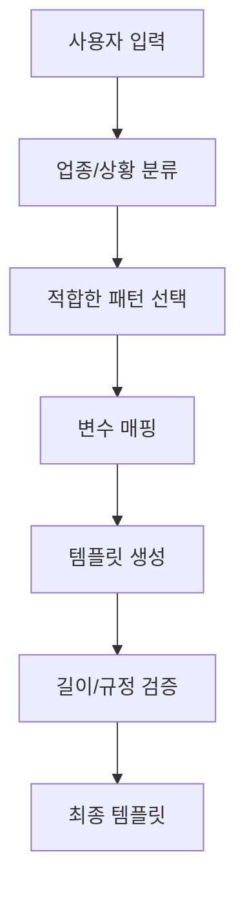

# 카카오 알림톡 템플릿 AI 생성 가이드

## 개요

JJ템플릿.xlsx의 '승인받은템플릿' 시트 분석을 통해 도출한 카카오 알림톡 템플릿의 성공 패턴과 AI 생성 시스템 구축을 위한 가이드입니다.

**분석 데이터**: 449개 승인받은 템플릿 (418개 고유 템플릿)

## 1. 핵심 발견사항

### 1.1 템플릿 기본 통계
- **평균 길이**: 110.7자 (최소 22자, 최대 316자)
- **권장 길이**: 80-150자 (전체의 55.7%)
- **메시지 성격**: 순수 정보성 메시지가 압도적 다수 (광고성 극소수)

### 1.2 주요 분류 체계
- **1차 분류**: 서비스이용(287개, 63.9%) > 상품(41개) > 예약(35개) > 결제(26개)
- **2차 분류**: 이용안내/정보(209개, 46.5%) > 방문안내(38개) > 결제완료(26개) > 상담문의(23개)

### 1.3 변수 사용 패턴
- **최빈 변수**: `#{고객성명}` (252회, 56.1%)
- **업체 관련**: `#{업체명}` (59회), `#{접수 서비스명}` (48회)
- **일시 관련**: `#{날짜}` (50회), `#{시간}` (17회)
- **거래 관련**: `#{주문번호}` (16회), `#{상품명}` (31회)

## 2. 템플릿 생성 패턴 가이드

### 2.1 성공적인 시작 패턴

```
가장 많이 사용되는 시작 패턴:
1. "안녕하세요 #{고객성명}님, " (표준 인사형)
2. "○○ 접수 : #{서비스명} ○○" (접수 확인형)
3. "안녕하세요, 접수 서비스입니다." (서비스 소개형)
```

### 2.2 인사말 사용 가이드

| 인사말 | 사용 빈도 | 권장 사용 상황 |
|--------|-----------|----------------|
| 안녕하세요 | 307개 (68.4%) | 모든 상황에 무난하게 사용 |
| ~님, | 200개 (44.5%) | 개인화된 메시지 |
| 고객님 | 111개 (24.7%) | 공식적인 비즈니스 메시지 |
| ~님께서 | 32개 (7.1%) | 존경 표현이 필요한 경우 |
| 회원님 | 19개 (4.2%) | 회원제 서비스 |

### 2.3 업종별 템플릿 특성

#### 서비스이용 (287개, 전체의 63.9%)
- **특징적 단어**: 고객성명, 접수, 추가, 메시지, 관련
- **주요 변수**: `#{고객성명}`, `#{업체명}`, `#{날짜}`
- **평균 길이**: 약 110자
- **구조 패턴**: 인사 → 서비스 내용 → 추가 안내 → 연락처/버튼

#### 상품 (41개)
- **특징적 단어**: 고객성명, 상품, 주문번호, 준비
- **주요 변수**: `#{고객성명}`, `#{상품명}`, `#{주문번호}`
- **구조 패턴**: 인사 → 상품 상태 → 픽업/배송 안내

#### 예약 (35개)
- **특징적 단어**: 예약, 고객성명, 업체명, 시간
- **주요 변수**: `#{고객성명}`, `#{업체명}`, `#{시간}`
- **구조 패턴**: 인사 → 예약 확인 → 방문 안내 → 변경/취소 안내

#### 결제 (26개)
- **특징적 단어**: 고객성명, 상품명, 주문번호, 결제
- **주요 변수**: `#{고객성명}`, `#{상품명}`, `#{주문번호}`
- **구조 패턴**: 인사 → 결제 완료 → 상품/서비스 안내

## 3. 길이별 템플릿 전략

### 3.1 짧은 템플릿 (80자 이하, 121개)
- **주요 용도**: 단순 확인, 완료 알림
- **구조**: 인사 + 핵심 메시지 + 버튼
- **예시 패턴**: "안녕하세요 #{고객성명}님, #{서비스} 완료되었습니다."

### 3.2 중간 템플릿 (81-150자, 250개) - **권장**
- **주요 용도**: 표준적인 알림 메시지
- **구조**: 인사 + 상황 설명 + 추가 안내 + 행동 유도
- **최적 패턴**

### 3.3 긴 템플릿 (151자 이상, 78개)
- **주요 용도**: 복잡한 절차, 상세 안내
- **주의사항**: 가독성 확보를 위한 단락 분리 필요

## 4. 버튼 설계 가이드

### 4.1 주요 버튼 텍스트 (사용 빈도순)

| 버튼 텍스트 | 사용 횟수 | 권장 사용 상황 |
|-------------|-----------|----------------|
| 자세히 확인하기 | 288개 (64.1%) | 상세 정보 제공 필요시 |
| X | 40개 (8.9%) | 단순 확인 |
| 상세 확인 | 31개 (6.9%) | 추가 정보 확인 |
| 확인하기 | 11개 (2.4%) | 일반적 확인 |
| 상세 정보 확인하기 | 8개 (1.8%) | 자세한 설명 필요시 |

### 4.2 버튼-분류 매칭 가이드
- **이용안내/정보**: "자세히 확인하기", "상세 확인"
- **방문안내**: "자세히 확인하기", "길찾기"
- **회원가입**: "가입하기", "확인하기"

## 5. AI 템플릿 생성 시스템 구축 방안

### 5.1 템플릿 생성 프로세스



### 5.2 핵심 생성 규칙

#### 규칙 1: 분류 기반 패턴 선택
```python
분류별_패턴 = {
    "서비스이용": {
        "시작": "안녕하세요 #{고객성명}님,",
        "본문": "요청하신 {서비스}가 {상태}되었습니다.",
        "안내": "자세한 내용은 아래 버튼을 통해 확인하실 수 있습니다.",
        "버튼": "자세히 확인하기"
    }
}
```

#### 규칙 2: 변수 우선순위 적용
1. **필수 변수**: `#{고객성명}` (모든 템플릿)
2. **상황별 필수**:
   - 상품: `#{상품명}`, `#{주문번호}`
   - 예약: `#{날짜}`, `#{시간}`, `#{업체명}`
   - 서비스: `#{서비스명}`, `#{업체명}`

#### 규칙 3: 길이 최적화
- 목표 길이: 80-150자
- 필수 요소: 인사말(15-20자) + 핵심 내용(40-80자) + 안내문(20-40자) + 마무리(10-15자)

### 5.3 품질 검증 체크리스트

#### 필수 검증 항목
- [ ] 인사말 포함 여부
- [ ] 고객성명 변수 사용
- [ ] 80-150자 길이 준수
- [ ] 버튼 텍스트 적절성
- [ ] 카카오 정책 준수 (광고성 내용 최소화)

#### 품질 향상 항목
- [ ] 업종별 특화 단어 포함
- [ ] 적절한 높임말 사용
- [ ] 명확한 행동 유도
- [ ] 연락처/추가 정보 제공

## 6. RAG 시스템 구축 방안

### 6.1 벡터 데이터베이스 구성
```
템플릿_벡터DB = {
    "분류정보": [1차분류, 2차분류, 업무분류],
    "템플릿_텍스트": "실제 승인받은 템플릿 내용",
    "변수_목록": ["#{고객성명}", "#{업체명}", ...],
    "메타데이터": {
        "길이": 110,
        "버튼": "자세히 확인하기",
        "승인일자": "2024-08-27"
    }
}
```

### 6.2 검색 전략
1. **의도 분류**: 사용자 입력을 1차/2차 분류로 매핑
2. **유사도 검색**: 가장 유사한 승인 템플릿 5-10개 검색
3. **패턴 추출**: 공통 구조와 변수 패턴 분석
4. **템플릿 생성**: 패턴을 기반으로 새로운 템플릿 생성

### 6.3 학습 데이터 활용
- **긍정 사례**: 승인받은 418개 고유 템플릿
- **구조 학습**: 인사말-본문-안내-마무리 패턴
- **변수 학습**: 업종별 주요 변수 패턴
- **버튼 학습**: 상황별 적절한 버튼 선택

## 7. 구현 권장사항

### 7.1 개발 우선순위
1. **1단계**: 기본 템플릿 생성 (상위 3개 분류)
2. **2단계**: 변수 자동 매핑 시스템
3. **3단계**: 길이 및 정책 준수 검증
4. **4단계**: 사용자 피드백 기반 개선

### 7.2 기술 스택 권장
- **AI/ML**: OpenAI GPT-4, LangChain
- **벡터 DB**: Chroma, FAISS
- **백엔드**: FastAPI (Python 3.13)
- **프론트엔드**: React/Vue.js
- **데이터베이스**: MySQL 8

### 7.3 품질 관리
- **A/B 테스트**: 생성된 템플릿의 승인율 측정
- **사용자 피드백**: 만족도 및 수정 요청 분석
- **지속적 학습**: 새로운 승인 템플릿으로 모델 업데이트

## 결론

본 분석을 통해 카카오 알림톡 템플릿의 명확한 성공 패턴을 도출했습니다. 이를 기반으로 한 AI 생성 시스템은:

1. **높은 승인율**: 검증된 패턴 기반 생성
2. **사용자 편의성**: 최소 입력으로 최적 템플릿 생성
3. **정책 준수**: 카카오 승인 기준 자동 적용
4. **확장성**: 새로운 업종/상황 대응 가능

이러한 시스템을 통해 소상공인들이 복잡한 승인 과정 없이도 효과적인 카카오 알림톡 템플릿을 생성할 수 있을 것입니다.

---
*분석 기준일: 2024년 8월 27일 / 분석 템플릿 수: 449개*